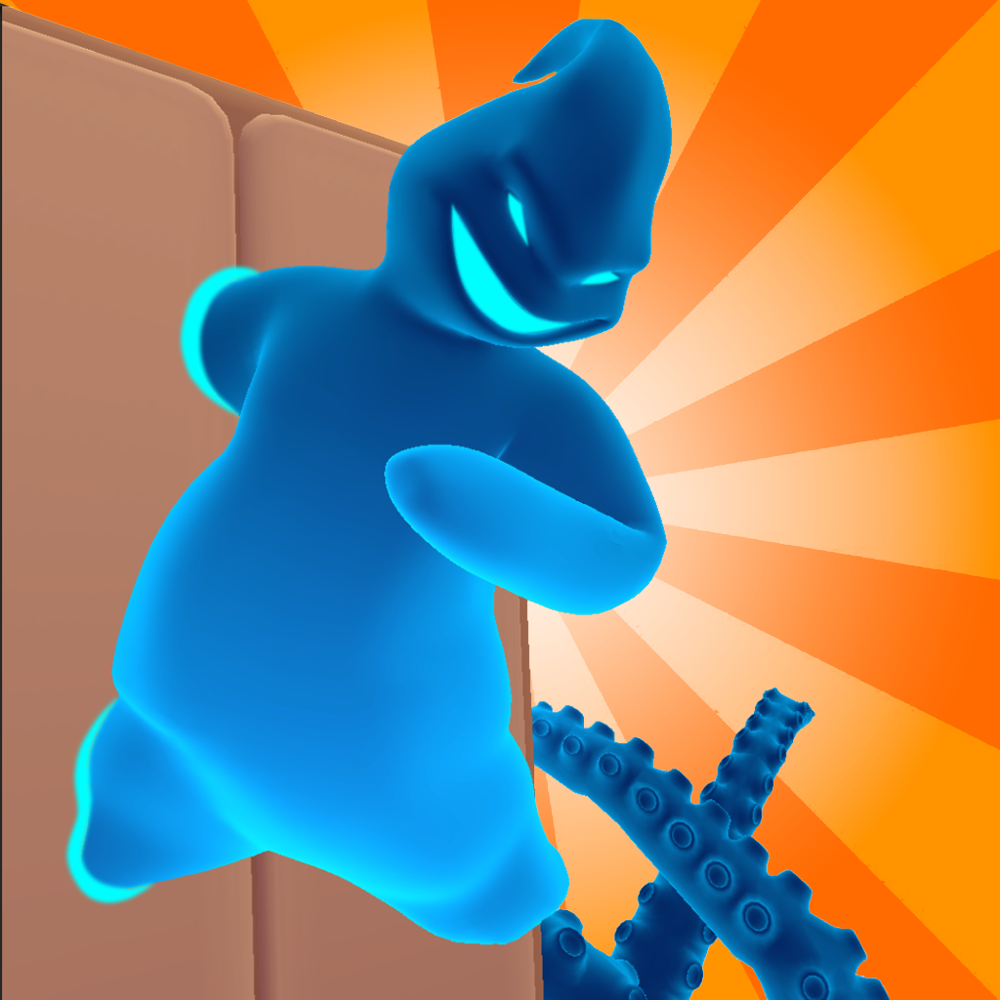

# 👻 Scare Them All

> Игра на Unity, где вы — призрак, терроризирующий обитателей дома. Но делать это нужно с умом...

---

## 🕹️ Описание

В этой игре вы играете за **призрака**, способного вселяться в предметы интерьера и пугать обитателей дома. Но будьте осторожны:

- Если вы **напугаете слишком резко**, человек может **сломать предмет**, в котором вы прячетесь.
- Если **вас увидят** до начала "шоу" — просто **убегут**, и шанс напугать будет упущен.
- Вам нужно использовать **наблюдательность, тайминг и креатив**, чтобы довести всех до истерики 👀

---

## 🎥 Геймплей

---

## 🎥 Ссылка на видео геймплея

https://drive.google.com/file/d/1YnY6nmn781QYb4HCpdg81VSHyA29J4zS/view?usp=drive_link

---

## 🧩 Основные механики

- 👻 Вселение в объекты
- 😱 Стелс-испуг: анализируйте поведение обитателей и выбирайте момент
- 🪓 Реакция: домочадцы могут ломать испорченные объекты
- 🏃‍♂️ Заметили? Убежали. И вы остались без цели

---

## 🛠️ Технологии

- Unity (C#)
- Mobile Game
- NavMesh
- URP
